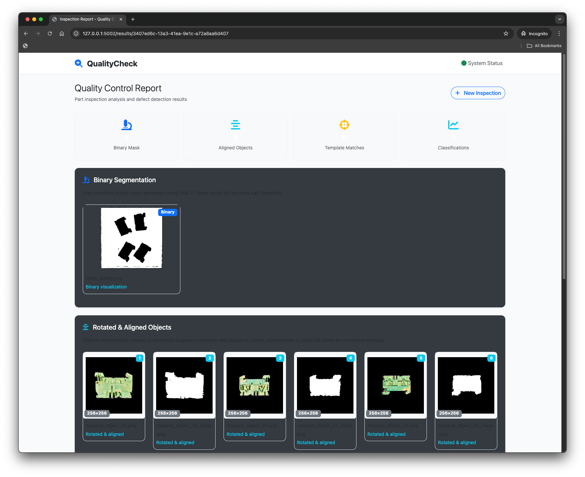

# PHinterland Hack - Object Detection & Classification

Our solution for the Weidmüller challenge at Hinterland of Things 2025. We built a computer vision pipeline that segments, extracts, aligns, and compares objects from images.

The system has four main parts: **`app_segmentation.py`** uses SAM 2.0/2.1 for interactive image segmentation, **`app_alignment.py`** extracts and aligns individual objects from binary masks, **`app_matching.py`** performs sophisticated rotation/scale optimization for optimal object alignment, and **`app_classifier.py`** compares objects with templates using multiple similarity metrics. The pipeline uses advanced CV techniques including IoU, SSIM, keypoint extraction, and comprehensive rotation testing.

Main features: SAM 2.0/2.1-based segmentation, binary mask processing, object extraction with rotation alignment, sophisticated template matching with rotation/scale combinations, and multi-metric similarity scoring. Outputs include segmented masks, aligned object cuts, overlay visualizations, and detailed JSON comparison results.

## 🎯 Challenge Background

This solution addresses the **Weidmüller Challenge** from Hinterland Hack 2025: developing an AI-powered visual quality control system for automated anomaly detection in manufacturing. The challenge involved creating a proof-of-concept that can reliably distinguish between good and defective parts from production line images of terminal blocks, despite flexible part positioning and high product variance. Our computer vision pipeline tackles object recognition, alignment, and template-based comparison to enable scalable quality control across different products and production lines.

## 🌐 Web Application

We also provide a **Flask web interface** for easy image processing:



- **Upload images** through a modern drag-and-drop interface
- **Interactive segmentation** with optional point selection for guided processing  
- **Real-time results** showing masks and extracted objects
- **Gallery view** with zoom functionality for detailed inspection

**Quick Start:**
```bash
python3 app.py
# Access at http://localhost:5001
```

The web app integrates the processing modules into a seamless workflow - upload an image, get segmentation masks, and view the aligned object cuts in your browser.

## 📊 JSON Output Structure

The system outputs detailed classification results in JSON format. Here's the structure:

```
Classification Results JSON
├── [Object_Name].png                    # Source object being analyzed
│   ├── [Template_Name].png              # Template being compared against
│   │   ├── metrics                      # Computer vision metrics
│   │   │   ├── ssim: float             # Structural Similarity Index (0-1, higher = more similar)
│   │   │   ├── mse: float              # Mean Squared Error (lower = more similar)
│   │   │   ├── psnr: float             # Peak Signal-to-Noise Ratio (higher = better quality)
│   │   │   ├── ncc: float              # Normalized Cross-Correlation (0-1, higher = more similar)
│   │   │   ├── histogram_correlation: float  # Color distribution similarity (0-1)
│   │   │   └── edge_similarity: float  # Edge pattern matching score (0-1)
│   │   ├── alignment_info               # Spatial alignment details
│   │   │   ├── overlap_score: float    # How well objects overlap (0-1)
│   │   │   ├── best_position: [x, y]   # Optimal alignment coordinates
│   │   │   └── transformation_applied: bool  # Whether alignment was performed
│   │   ├── point_similarity: float     # Keypoint matching score (0-1)
│   │   ├── keypoints_count             # Feature detection results
│   │   │   ├── object: int             # Keypoints found in source object
│   │   │   └── template: int           # Keypoints found in template
│   │   ├── edge_image: string          # Path to edge comparison visualization
│   │   ├── aligned_comparison: string  # Path to side-by-side comparison
│   │   ├── object_aligned_path: string # Path to aligned source object
│   │   ├── template_aligned_path: string # Path to aligned template
│   │   ├── object_path: string         # Original object image path
│   │   └── template_path: string       # Original template image path
│   └── [Additional_Templates]...        # More template comparisons
└── [Additional_Objects]...              # More source objects
```

**Key Metrics Explained:**
- **SSIM** (0.0-1.0): Structural similarity - values >0.6 indicate good matches, >0.9 excellent
- **PSNR** (dB): Peak signal-to-noise ratio - higher values mean better quality/alignment
- **NCC** (0.0-1.0): Normalized cross-correlation - measures linear relationship between images
- **Overlap Score** (0.0-1.0): Spatial overlap after optimal rotation/scale alignment
- **Point Similarity** (0.0-1.0): Keypoint-based shape comparison using sophisticated geometric methods

## 📄 License

This project is released into the public domain under the Unlicense.